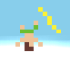

# rad waves

Rad waves is an arcade surfing game. You get points for doing spins and picking up coins, but die if you touch a skull, just like in real life.

The game is written is phaser.js using javascript, html and css.

*How can I play this?*

It's up on itch.io: https://supercoolgames.itch.io/rad-waves
